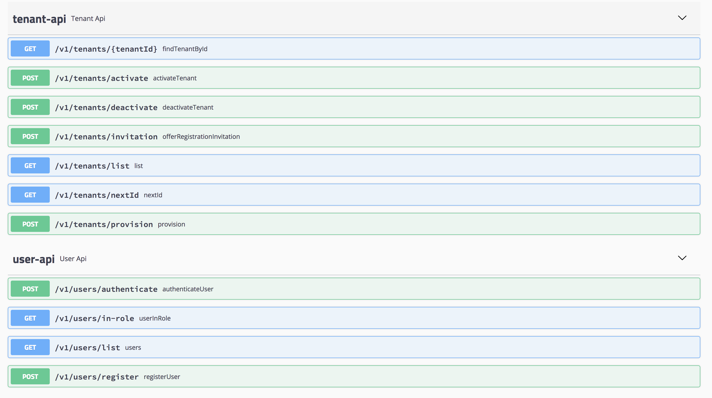
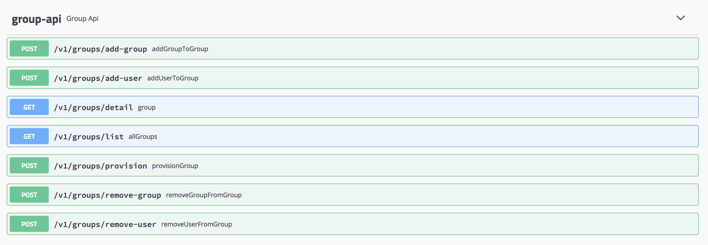
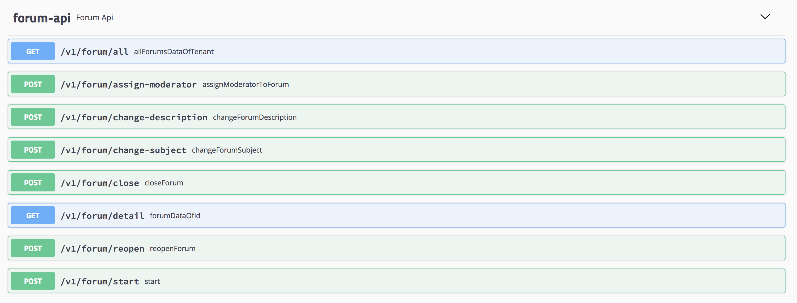
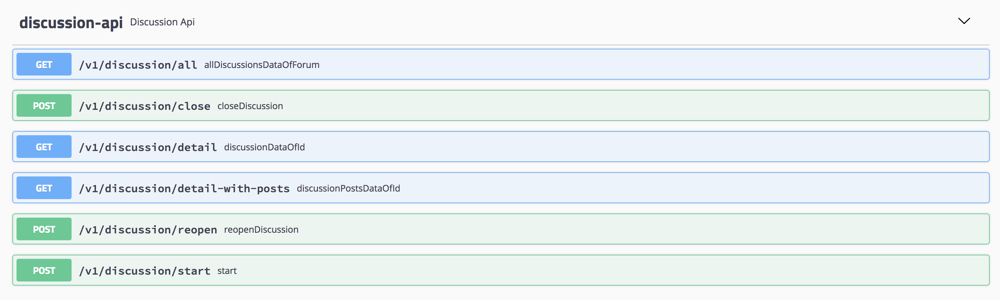
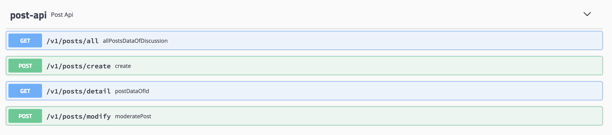
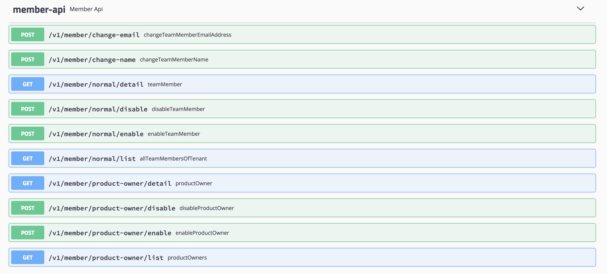
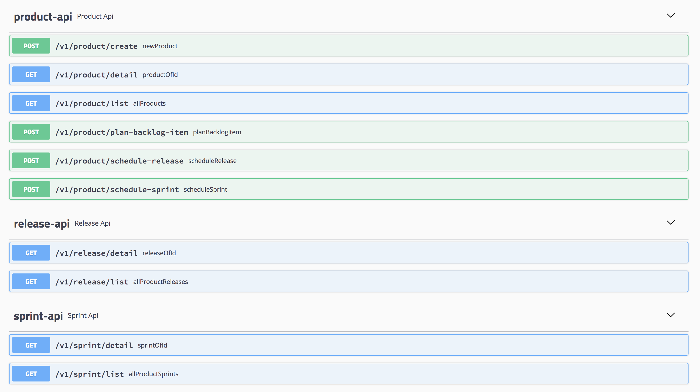
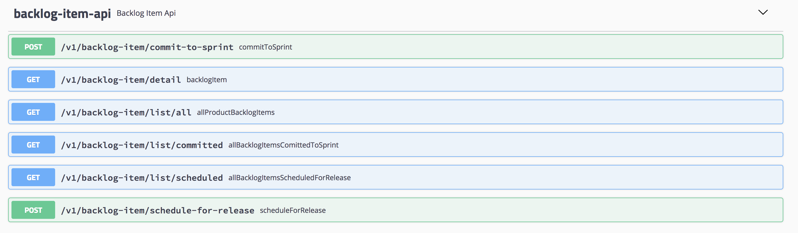

# zhacker-sample-ovation

> 《实现领域驱动设计》对应的源码，并整合了spring cloud，以rest api形式对外暴露服务。

其中涉及的基础设施如下：

* SpringMVC：服务暴露方式
* Swagger2：api文档
* Spring Cloud Zookeeper: 服务发现
* zhacker-core：领域模型基础类库
* zhacker-boot-starter-event: 领域事件发布等设施
* Kafka：上下文映射中的消息发送
* Hibernate + Mybatis + SpringJdbc + LevelDB：仓储实现
* Mysql + LevelDB：数据库存储数据

## 项目结构

#### zhacker-sample-ovation-identityaccess

> 身份认证上下文实现

#### zhacker-sample-ovation-collaboration

> 协作上下文实现

#### zhacker-sample-ovation-agilepm

> 敏捷项目管理上下文实现

